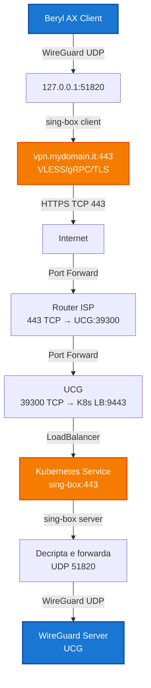

{ loading=lazy }

Ultimamente mi sono trovato spesso a lavorare da reti con firewall restrittivi che bloccano le VPN. Anche WireGuard, che di solito funziona bene, viene identificato e bloccato da molti firewall aziendali e sistemi DPI (Deep Packet Inspection).

Ho deciso di risolvere il problema mascherando completamente il traffico UDP di WireGuard come traffico HTTPS reale su TCP/443, utilizzando **sing-box** con il protocollo **VLESS + gRPC + TLS**. Il risultato è un tunnel VPN che appare come una normale connessione HTTPS a qualsiasi firewall o sistema di ispezione.

Devo ammettere che senza l'ausilio di **Claude** e **ChatGPT** questa soluzione sarebbe stata molto più difficile da trovare e implementare. Claude in particolare è stato fondamentale nel debug di tutte le problematiche incontrate durante il setup, aiutandomi a risolvere errori di configurazione, problemi di routing e questioni relative alla sintassi di sing-box fino ad arrivare al flusso correttamente funzionante.

<!-- more -->

## Il problema

WireGuard utilizza UDP sulla porta 51820, e molti firewall aziendali bloccano questo tipo di traffico. Anche cambiando porta, il protocollo WireGuard può essere facilmente identificato tramite DPI. La soluzione che ho implementato è incapsulare tutto il traffico UDP dentro un tunnel TCP che sembri una normale connessione HTTPS.

## Il mio setup

Ecco l'architettura che ho a disposizione:

### Hardware e infrastruttura

- **Client**: Beryl AX (router OpenWrt con architettura ARM64/aarch64) che uso come router portatile
- **Server**: Cluster Kubernetes con LoadBalancer (nel mio caso uso Cilium LB-IPAM, ma funziona anche con MetalLB)
- **Gateway**: UniFi Cloud Gateway (UCG) che funge da router principale e server WireGuard
- **Router ISP**: Router con port forwarding configurato

### Cosa mi serviva

Per questo setup ho utilizzato:

1. **Un client con OpenWrt** (nel mio caso un Beryl AX) dove installare sing-box
2. **Il mio cluster Kubernetes** già funzionante con:
   - LoadBalancer configurato (uso Cilium LB-IPAM)
   - cert-manager già installato e configurato
3. **Un dominio pubblico** con DNS configurato per puntare al mio IP pubblico
4. **Il mio server WireGuard** già configurato sull'UCG
5. **Accesso al router** per configurare port forwarding

### Architettura della soluzione



**Caratteristiche principali:**

- TLS reale con certificato Let's Encrypt valido
- Protocollo gRPC (HTTP/2) con ALPN
- Traffico indistinguibile da HTTPS normale (browser-like)
- UDP di WireGuard completamente nascosto dentro TCP
- Bypass di firewall che bloccano VPN

## Parte 1 – Configurazione Client (Beryl AX / OpenWrt)

### Installazione di sing-box

Ho installato sing-box sul Beryl AX (architettura **aarch64 / arm64**):

```bash
cd /tmp
wget -O sing-box.tar.gz \
  https://github.com/SagerNet/sing-box/releases/download/v1.12.17/sing-box-1.12.17-linux-arm64.tar.gz

tar xzf sing-box.tar.gz
mv sing-box*/sing-box /usr/bin/sing-box
chmod +x /usr/bin/sing-box
rm -rf sing-box*
```

Ho verificato l'installazione:

```bash
sing-box version
```

Output: `sing-box version 1.12.17`

### Configurazione del client sing-box

Ho creato la directory di configurazione:

```bash
mkdir -p /etc/sing-box
```

Poi ho creato il file `/etc/sing-box/config.json`:

```json
{
  "log": {
    "level": "info"
  },
  "inbounds": [
    {
      "type": "direct",
      "tag": "wg-in",
      "listen": "127.0.0.1",
      "listen_port": 51820,
      "network": "udp"
    }
  ],
  "outbounds": [
    {
      "type": "vless",
      "tag": "proxy",
      "server": "vpn.mydomain.it",
      "server_port": 443,
      "uuid": "TUO-UUID-GENERATO",
      "tls": {
        "enabled": true,
        "server_name": "vpn.mydomain.it"
      },
      "transport": {
        "type": "grpc",
        "service_name": "chrome"
      },
      "packet_encoding": "xudp"
    }
  ],
  "route": {
    "rules": [
      {
        "inbound": "wg-in",
        "outbound": "proxy"
      }
    ]
  }
}
```

Ho generato un UUID v4 usando `uuidgen` che corrisponde a quello configurato sul server. Il `packet_encoding: "xudp"` è essenziale per trasportare UDP su TCP in modo efficiente, mentre `listen: "127.0.0.1"` limita l'ascolto solo in locale.

### Integrazione con OpenWrt (procd)

Ho creato il service script `/etc/init.d/sing-box`:

```bash
#!/bin/sh /etc/rc.common

START=95
STOP=10
USE_PROCD=1

start_service() {
  procd_open_instance
  procd_set_param command /usr/bin/sing-box run -c /etc/sing-box/config.json
  procd_set_param respawn
  procd_set_param stdout 1
  procd_set_param stderr 1
  procd_close_instance
}
```

Ho abilitato e avviato il servizio:

```bash
chmod +x /etc/init.d/sing-box
/etc/init.d/sing-box enable
/etc/init.d/sing-box start
```

Per gestire il servizio uso i comandi standard di OpenWrt:

```bash
/etc/init.d/sing-box stop     # Ferma
/etc/init.d/sing-box start    # Avvia
/etc/init.d/sing-box restart  # Riavvia
/etc/init.d/sing-box status   # Stato
```

### Configurazione WireGuard sul client

Per massima flessibilità, ho creato **due profili WireGuard**:

#### Profilo 1: "WireGuard Direct" (reti normali)

Uso questo profilo quando sono su reti che non bloccano VPN:

```ini
[Interface]
Address = 10.20.0.4/32
PrivateKey = TUA_CHIAVE_PRIVATA
DNS = 192.168.0.5,192.168.0.6
MTU = 1280

[Peer]
PublicKey = CHIAVE_PUBBLICA_SERVER
AllowedIPs = 0.0.0.0/0
Endpoint = vpn.mydomain.it:51820
PersistentKeepalive = 25
```

#### Profilo 2: "WireGuard Office" (con sing-box)

Uso questo profilo quando sono su reti restrittive (ufficio, hotel, ecc.):

```ini
[Interface]
Address = 10.20.0.4/32
PrivateKey = TUA_CHIAVE_PRIVATA
DNS = 192.168.0.5,192.168.0.6
MTU = 1280

[Peer]
PublicKey = CHIAVE_PUBBLICA_SERVER
AllowedIPs = 0.0.0.0/0
Endpoint = 127.0.0.1:51820
PersistentKeepalive = 25
```

La differenza chiave è che l'endpoint punta a `127.0.0.1:51820` (sing-box locale) invece del server remoto.

In pratica:

- Da casa/hotspot → uso il profilo "Direct"
- In ufficio/reti restrittive → uso il profilo "Office"

### Test e troubleshooting client

Per validare la configurazione:

```bash
sing-box check -c /etc/sing-box/config.json
```

Per verificare che il listener UDP sia attivo:

```bash
netstat -lun | grep 51820
```

Output: `udp   0   0 127.0.0.1:51820   0.0.0.0:*`

Per verificare il processo:

```bash
ps | grep sing-box
```

Per i log in tempo reale:

```bash
logread -f | grep sing-box
```

Per testare la connessione WireGuard:

```bash
wg show
```

Output con handshake recente:

```
interface: wg0
  latest handshake: 5 seconds ago
  transfer: 1.2 KiB received, 892 B sent
```

## Parte 2 – Configurazione Server (Kubernetes)

### Prerequisiti

Nel mio caso avevo già:

- Cluster Kubernetes funzionante
- cert-manager configurato con Let's Encrypt
- LoadBalancer funzionante (Cilium LB-IPAM)
- Accesso per creare risorse nel namespace `apps`

### 1. Certificato TLS

Ho creato il certificato TLS per il mio dominio:

```yaml
apiVersion: cert-manager.io/v1
kind: Certificate
metadata:
  name: wg-domain-cert
  namespace: apps
spec:
  secretName: wg-ildoc-it-tls
  issuerRef:
    name: letsencrypt-prod
    kind: ClusterIssuer
  dnsNames:
    - vpn.mydomain.it
```

Ho verificato il certificato:

```bash
kubectl get certificate -n apps
kubectl describe certificate wg-domain-cert -n apps
```

### 2. Secret UUID

Uso External Secrets Operator per gestire i secret da Vault. Il file completo è disponibile nel repository:

```yaml
--8<-- "kubernetes/applications/sing-box/secrets.yaml"
```

In alternativa, non usando External Secrets, si può creare un Secret normale con l'UUID del client. L'UUID deve corrispondere esattamente a quello configurato sul client.

### 3. ConfigMap configurazione sing-box

Il ConfigMap completo è disponibile nel repository:

```yaml
--8<-- "kubernetes/applications/sing-box/configmap.yaml"
```

I placeholder `UUID-CLIENT`, `GATEWAY-ADDRESS` e `GATEWAY-PORT` vengono sostituiti dall'initContainer del deployment. Il `action: "route-options"` è necessario dalla versione 1.11.0+ (nuova sintassi per override). Ho impostato il log level a `debug` per facilitare il troubleshooting, ma per produzione si può cambiare in `info`.

### 4. Deployment sing-box

Il deployment completo è disponibile nel repository:

```yaml
--8<-- "kubernetes/applications/sing-box/deployment.yaml"
```

L'initContainer sostituisce i placeholder `UUID-CLIENT`, `GATEWAY-ADDRESS` e `GATEWAY-PORT` con i valori dai secret. Ho impostato `revisionHistoryLimit: 3` per limitare lo spazio occupato dalle vecchie revisioni.

### 5. Network Policy per isolamento

Ho aggiunto una Network Policy per limitare il traffico in ingresso e uscita dal pod sing-box:

```yaml
--8<-- "kubernetes/applications/sing-box/networkpolicy.yaml"
```

Questa policy garantisce che il pod sing-box possa:

- Ricevere connessioni solo sulla porta 443
- Comunicare solo con l'UCG sulla porta 51820 UDP (WireGuard)
- Rispondere ai client
- Effettuare query DNS

### 6. Service

Il Service completo è disponibile nel repository:

```yaml
--8<-- "kubernetes/applications/sing-box/service.yaml"
```

La porta esposta dal LoadBalancer nel mio caso è 9443, e ho usato l'annotazione di Cilium per assegnare l'IP statico `192.168.0.83`.

### Deploy completo

Nel mio caso uso ArgoCD per il deploy in modalità GitOps, quindi le risorse vengono applicate automaticamente quando committo i file nel repository. I file sono nella cartella `kubernetes/applications/sing-box/` e vengono gestiti tramite ArgoCD.

Per verificare il deployment:

```bash
kubectl get pods -n apps -l app=sing-box
kubectl logs -f deployment/sing-box -n apps
kubectl get svc sing-box -n apps
```

## Parte 3 – Configurazione di rete

### 1. Port forwarding Router ISP

Ho configurato il port forwarding sul router ISP:

```
Porta esterna: 443 TCP
Porta interna: 39300 TCP
IP destinazione: IP WAN dell'UCG
```

### 2. Port forwarding UCG (UniFi)

Ho configurato il port forwarding via UI UniFi:

- Settings → Internet → Port Forwarding
- Creata nuova regola:
    - Name: `sing-box-to-k8s`
    - Enabled: ✅
    - From: WAN
    - Port: 39300
    - Protocol: TCP
    - Forward IP: `192.168.0.83` (IP del LoadBalancer K8s)
    - Forward Port: 9443

Ho verificato la regola attiva:

```bash
# SSH sull'UCG
iptables-save | grep 39300
```

### 3. Firewall UCG

Ho configurato le regole firewall sull'UCG per permettere:

**Regola 1 - WAN → K8s (TCP):**

- Type: LAN In
- Action: Accept
- Protocol: TCP
- Source: WAN
- Destination: IP LoadBalancer K8s
- Port: 9443

**Regola 2 - K8s → UCG WireGuard (UDP):**

- Type: LAN In
- Action: Accept
- Protocol: UDP
- Source: Subnet K8s (192.168.0.0/24 nel mio caso)
- Destination: IP UCG
- Port: 51820

## Parte 4 – Sicurezza e hardening

Esporre la porta 443 su Internet è sempre un rischio, soprattutto perché è una delle porte più bersagliate. Ho implementato diverse misure di sicurezza per proteggere il setup.

### 1. Country Restrictions sul gateway

Dato che mi connetto principalmente dall'Italia, ho configurato una whitelist geografica sull'UCG:

**Settings → Security → Protection → Country Restrictions**

Ho creato una restriction group che blocca tutti i paesi tranne l'Italia per il traffico inbound. Questo elimina circa l'80% del traffico malevolo automatizzato.

!!! warning "Attenzione quando si viaggia"
    Se viaggio all'estero, devo ricordarmi di aggiungere temporaneamente il paese dove mi trovo, altrimenti non riesco a connettermi. Potrei anche disabilitare temporaneamente la restriction.

### 2. IPS/IDS su UniFi Cloud Gateway

Ho abilitato l'Intrusion Prevention System sull'UCG:

**Settings → Security → Protection**

- Attivato **Intrusion Prevention** (toggle su ON)
- Selezionate le **Active Detections** per categoria "Hacking and Exploits"
- Abilitata la categoria **Malicious User Agents**
- Scelto livello **Balanced** (buon compromesso tra sicurezza e performance)

L'IPS analizza il traffico in tempo reale e blocca pattern di attacco noti. L'UCG supporta fino a 1 Gbps con IPS attivo, più che sufficiente per il mio caso.

### 3. CrowdSec su Kubernetes

Ho deployato CrowdSec come sistema di protezione aggiuntivo. CrowdSec è superiore a fail2ban tradizionale perché:

- È progettato nativamente per Kubernetes
- Usa threat intelligence condivisa da migliaia di utenti
- Blocca automaticamente IP con comportamenti malevoli
- Non richiede IP stabili del client

Ho installato CrowdSec tramite ArgoCD usando un chart Helm personalizzato. Il chart è nella cartella `kubernetes/charts/crowdsec/` e viene gestito in modalità GitOps insieme a tutte le altre applicazioni del cluster.

ArgoCD monitora il repository e applica automaticamente le modifiche quando committo i file. Il chart è basato su quello ufficiale di CrowdSec ma con configurazioni personalizzate per il mio ambiente, incluso l'acquisition dei log del pod sing-box.

Poi ho aggiunto un sidecar container al deployment di sing-box per bloccare IP malevoli prima che raggiungano l'applicazione:

```yaml
# Aggiunto al deployment sing-box
containers:
  # ... container sing-box esistente ...
  
  # Sidecar CrowdSec Firewall Bouncer
  - name: crowdsec-bouncer
    image: davidbcn86/crowdsec-firewall-bouncer-docker:latest-nftables
    securityContext:
      capabilities:
        add:
          - NET_ADMIN
    env:
      - name: CROWDSEC_LAPI_URL
        value: "http://crowdsec-service.crowdsec.svc.cluster.local:8080"
      - name: CROWDSEC_LAPI_KEY
        valueFrom:
          secretKeyRef:
            name: crowdsec-bouncer-key
            key: api-key
```

Il sidecar bouncer intercetta il traffico prima che arrivi a sing-box e droppa le connessioni da IP nella blocklist di CrowdSec.

Per generare l'API key del bouncer:

```bash
# Shell nel pod LAPI
kubectl -n crowdsec exec -it deployment/crowdsec-lapi -- sh

# Genera bouncer key
cscli bouncers add sing-box-bouncer

# Salvo la key in un Secret
kubectl create secret generic crowdsec-bouncer-key \
  --from-literal=api-key=API-KEY-GENERATA \
  --namespace=apps
```

Ho anche installato la collezione di scenari HTTP per rilevare pattern di attacco:

```bash
kubectl -n crowdsec exec -it deployment/crowdsec-lapi -- sh
cscli collections install crowdsecurity/base-http-scenarios
```

### 4. Security Context nel deployment

Ho configurato security context restrittivi per il pod sing-box:

```yaml
spec:
  securityContext:
    runAsNonRoot: true
    runAsUser: 1000
    runAsGroup: 1000
    fsGroup: 1000
    seccompProfile:
      type: RuntimeDefault
  
  containers:
    - name: sing-box
      securityContext:
        allowPrivilegeEscalation: false
        readOnlyRootFilesystem: true
        runAsNonRoot: true
        runAsUser: 1000
        runAsGroup: 1000
        capabilities:
          drop:
            - ALL
          add:
            - NET_BIND_SERVICE  # Solo per bind porta 443
```

Questo garantisce che il container:

- Non giri come root
- Non possa escalare privilegi
- Abbia filesystem read-only
- Abbia solo la capability minima necessaria

### 5. Monitoring e alerting

Ho abilitato le notifiche UniFi per eventi di sicurezza:

**Settings → Notifications**

- ✅ Gateway Events
- ✅ IPS/IDS Threats
- ✅ Unauthorized Access Attempts

Per monitorare le connessioni attive sulla porta configurata:

```bash
# SSH sull'UCG
watch -n 5 'netstat -tn | grep :39300 | wc -l'
```

Per vedere i top IP sorgenti:

```bash
netstat -tn | grep :39300 | awk '{print $5}' | cut -d: -f1 | sort | uniq -c | sort -rn
```

### 6. Protezione avanzata UCG

Ho abilitato anche le protezioni avanzate disponibili su UniFi:

**Settings → Security → Protection → Advanced**

- ✅ **Restrict Access to Malicious IP Addresses**: Blocca IP noti per traffico malevolo
- ✅ **Restrict Access to Tor**: Blocca nodi Tor (non mi servono)

### Strategia di sicurezza a livelli

La mia strategia di protezione funziona su più livelli:

1. **Country Restrictions** → Prima linea di difesa, blocca ~80% del traffico malevolo
2. **IPS/IDS** → Analisi DPI per rilevare attacchi noti
3. **CrowdSec** → Blocco automatico IP con comportamenti sospetti
4. **Network Policy** → Isolamento del pod sing-box
5. **Security Context** → Principio del minimo privilegio

Questo approccio difensivo mi protegge dalla maggior parte degli attacchi automatizzati senza richiedere IP statici o whitelist manuali.

## Parte 5 – Test end-to-end

### 1. Test connettività base

Dal client ho testato la raggiungibilità del server:

```bash
nc -zv vpn.mydomain.it 443
```

Output: `Connection to vpn.mydomain.it 443 port [tcp/https] succeeded!`

### 2. Test TLS e HTTP/2

```bash
curl -vk --http2 https://vpn.mydomain.it:443
```

Nell'output ho verificato:

- `SSL connection using TLSv1.3`
- `ALPN: server accepted h2` (HTTP/2)
- Certificato valido per `vpn.mydomain.it`

### 3. Test WireGuard

Sul client:

```bash
wg show
```

Output:

```
interface: wg0
  public key: ...
  private key: (hidden)
  listening port: ...

peer: CHIAVE_PUBBLICA_SERVER
  endpoint: 127.0.0.1:51820
  allowed ips: 0.0.0.0/0
  latest handshake: 10 seconds ago
  transfer: 5.21 KiB received, 3.14 KiB sent
  persistent keepalive: every 25 seconds
```

Ping test attraverso VPN:

```bash
ping -c 4 10.20.0.1  # IP del server WireGuard
ping -c 4 8.8.8.8    # Test connettività generale
```

### 4. Verifica traffico mascherato

Per verificare il DPI bypass, da una rete restrittiva ho controllato che il traffico sembri HTTPS normale. Il traffico visibile al firewall è solo TCP 443 verso vpn.mydomain.it con handshake TLS valido e ALPN HTTP/2.

Ho usato tcpdump per confermare che non ci sia traccia di UDP o WireGuard:

```bash
tcpdump -i eth0 port 443 -nn
```

Vedo solo pacchetti TCP con payload criptato TLS.

### 5. Test CrowdSec

Per verificare che CrowdSec funzioni, ho controllato i log:

```bash
kubectl logs -f -n apps deployment/sing-box -c crowdsec-bouncer
```

E ho verificato le decisioni attive:

```bash
kubectl -n crowdsec exec -it deployment/crowdsec-lapi -- cscli decisions list
```

## Troubleshooting

### Client (Beryl AX)

Quando sing-box non si avvia, faccio un test manuale:

```bash
# Test manuale
sing-box run -c /etc/sing-box/config.json

# Verifica JSON
sing-box check -c /etc/sing-box/config.json
```

Se WireGuard non si connette:

```bash
# Verifica che sing-box ascolti
netstat -lun | grep 51820

# Test connessione al server
nc -zv vpn.mydomain.it 443

# Log dettagliati
logread -f | grep -E 'sing-box|wireguard'
```

Se l'endpoint è sbagliato, verifico che il profilo WireGuard "Office" usi `Endpoint = 127.0.0.1:51820`.

### Server (Kubernetes)

Se il pod va in crash:

```bash
kubectl logs -f deployment/sing-box -n apps
kubectl describe pod -l app=sing-box -n apps
```

Errori che ho incontrato:

- `certificate_path` o `key_path` errati
- UUID non sostituito correttamente
- `override_address` sintassi deprecata (ho usato `action: route-options`)

Per verificare il certificato:

```bash
kubectl get certificate -n apps
kubectl describe certificate wg-domain-cert -n apps
```

Se il LoadBalancer non è raggiungibile:

```bash
kubectl get svc sing-box -n apps
# Verifico che EXTERNAL-IP sia assegnato

# Test da un pod interno
kubectl run -it --rm debug --image=nicolaka/netshoot -- bash
nc -zv IP_LOADBALANCER 9443
```

Se il server WireGuard non è raggiungibile dal pod:

```bash
# Da un pod di debug
kubectl run -it --rm debug --image=nicolaka/netshoot -- bash
nc -zu IP_UCG 51820  # Test UDP
```

Se fallisce, verifico routing e firewall.

### CrowdSec

Se CrowdSec non blocca correttamente:

```bash
# Verifica che LAPI sia raggiungibile dal bouncer
kubectl -n apps exec -it deployment/sing-box -c crowdsec-bouncer -- sh
wget -O- http://crowdsec-service.crowdsec.svc.cluster.local:8080/health

# Controlla decisioni attive
kubectl -n crowdsec exec -it deployment/crowdsec-lapi -- cscli decisions list

# Testa manualmente un ban
kubectl -n crowdsec exec -it deployment/crowdsec-lapi -- cscli decisions add --ip 1.2.3.4 --duration 1h
```

## Note operative e best practices

### Sicurezza

Uso un UUID univoco per ogni dispositivo. cert-manager rinnova automaticamente Let's Encrypt ogni 60 giorni. CrowdSec fornisce protezione automatica contro IP malevoli senza bisogno di IP stabili per il client.

Dovrei configurare alert più sofisticati per:

- Handshake WireGuard falliti ripetuti
- Certificati in scadenza
- Decisioni CrowdSec per IP che tentano attacchi

### Performance

Il valore `1280` nel profilo WireGuard tiene conto dell'overhead di gRPC/TLS. sing-box è leggero ma l'overhead TLS+gRPC aumenta l'uso CPU del ~10-20%. La latenza è aumentata di +5-15ms rispetto a WireGuard diretto a causa dell'incapsulamento. CrowdSec aggiunge un overhead minimo (<1ms) grazie alla sua implementazione efficiente.

### Manutenzione

Per aggiornare sing-box client:

```bash
# Scarico nuova versione
wget -O /tmp/sing-box.tar.gz URL_NUOVA_VERSIONE
tar xzf /tmp/sing-box.tar.gz -C /tmp
/etc/init.d/sing-box stop
mv /tmp/sing-box*/sing-box /usr/bin/sing-box
/etc/init.d/sing-box start
```

Per aggiornare sing-box server:

```bash
kubectl rollout restart deployment/sing-box -n apps
```

Per aggiornare CrowdSec, modifico il chart nella cartella `kubernetes/charts/crowdsec/` e committo le modifiche. ArgoCD applica automaticamente gli aggiornamenti quando rileva i cambiamenti nel repository.

Per i backup:

- Client: `/etc/sing-box/config.json`
- Kubernetes: Export YAML con `kubectl get -o yaml`
- CrowdSec decisions: `cscli decisions list -o json`

### Limitazioni note

Il doppio incapsulamento (WireGuard in gRPC in TLS) riduce leggermente il throughput. Richiede sing-box 1.11.0+ per la nuova sintassi `route-options`. Il traffico criptato rende difficile il troubleshooting senza accesso ai log.

La country restriction blocca le connessioni se viaggio all'estero, quindi devo ricordarmi di aggiungere temporaneamente il paese o disabilitare la restrizione.

## Conclusione

Questo setup mi permette di:

✅ Bypassare firewall aziendali che bloccano VPN
✅ Mascherare completamente WireGuard come HTTPS normale
✅ Utilizzare certificati TLS validi e standard HTTP/2
✅ Mantenere flessibilità con due profili (diretto e mascherato)
✅ Implementare una soluzione stabile e mantenibile
✅ Proteggere il servizio esposto con difesa a più livelli

Il traffico risultante è **indistinguibile da una normale navigazione HTTPS** e supera anche i più sofisticati sistemi DPI. La combinazione di country restrictions, IPS/IDS e CrowdSec fornisce una protezione robusta contro attacchi automatizzati, senza richiedere IP statici del client.
Sembra funzionare e per ora sono soddisfatto del risultato. 

## Riferimenti

- [sing-box Documentation](https://sing-box.sagernet.org/)
- [VLESS Protocol](https://github.com/XTLS/Xray-core)
- [WireGuard Official](https://www.wireguard.com/)
- [OpenWrt procd](https://openwrt.org/docs/guide-developer/procd-init-scripts)
- [cert-manager](https://cert-manager.io/)
- [CrowdSec Documentation](https://docs.crowdsec.net/)
- [CrowdSec Kubernetes](https://docs.crowdsec.net/docs/getting_started/install_crowdsec_kubernetes)
